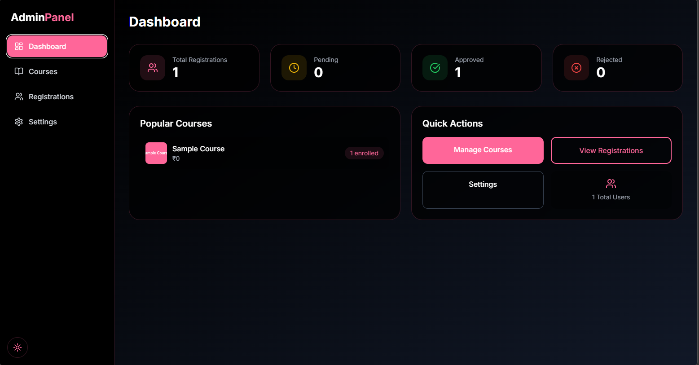
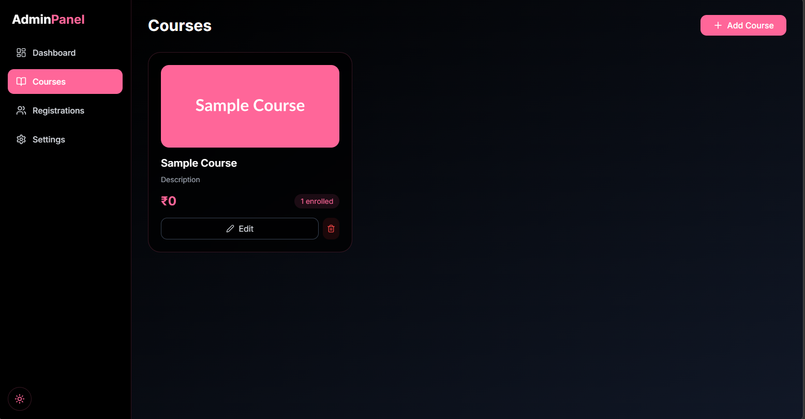
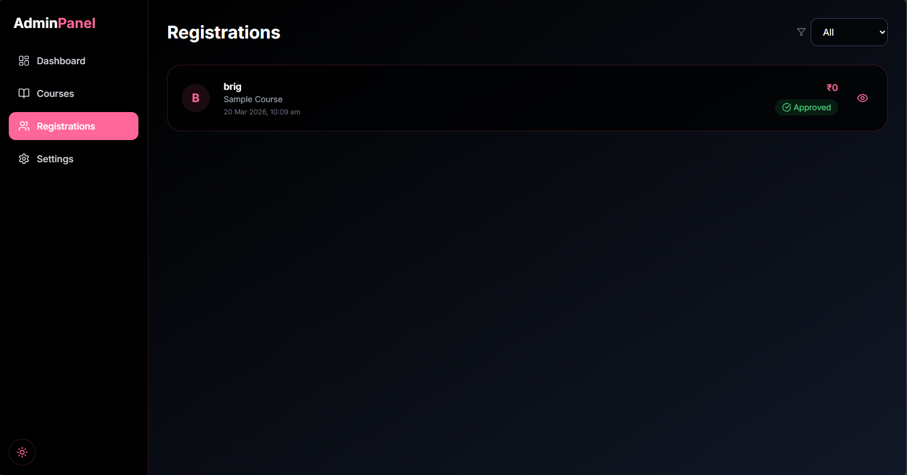
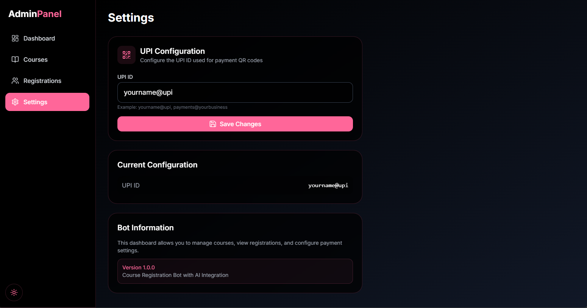

# GotCourse

A Telegram-based course registration system with an admin dashboard, AI-powered query handling, and UPI payment verification.

## Features

- **Multi-step Telegram Bot Registration** - Users can register for courses through an interactive Telegram bot
- **UPI QR Code Payments** - Dynamic QR code generation for payment collection
- **Screenshot Verification** - Admins can review payment screenshots before approval
- **AI-Powered Queries** - Mistral LLM integration for answering course-related questions
- **Admin Dashboard** - Modern React dashboard with dark/light theme support
- **Course Management** - Full CRUD operations for courses
- **Registration Workflow** - Approve/reject registrations with real-time updates

## Tech Stack

| Component | Technology |
|-----------|------------|
| Bot | Python, python-telegram-bot v21.5 |
| Backend | FastAPI, uvicorn, Motor (MongoDB async driver) |
| Dashboard | React 18, Vite, TailwindCSS, Zustand, React Query |
| AI | LangChain + Mistral AI |
| Database | MongoDB |

## Screenshots

Dashboard showing statistics, popular courses, and quick actions:



Course management with grid view and add/edit modal:



Registration list with status filters and detail modal:



UPI configuration and bot information settings:



## Complete Flow

### User Registration Flow

1. User sends `/start` to the Telegram bot
2. Bot displays welcome message with options: **Get Query** and **Register**
3. User selects **Register**
4. Bot prompts for **Full Name**
5. Bot prompts for **Address**
6. Bot displays available courses with fees
7. User selects a course
8. Bot displays UPI QR code for payment
9. User makes payment and sends screenshot
10. Registration is submitted for admin review
11. Admin approves/rejects in the dashboard
12. User receives confirmation

### Admin Workflow

1. Access the admin dashboard
2. View statistics and popular courses
3. Add/edit/delete courses
4. Review pending registrations with payment screenshots
5. Approve or reject registrations
6. Configure UPI ID for payment QR codes

## Project Structure

```
TGbot/
├── bot/                    # Telegram bot
│   ├── bot.py              # Main bot entry point
│   ├── handlers/            # Command and callback handlers
│   │   ├── start.py         # /start command
│   │   ├── registration.py  # Registration flow
│   │   ├── payment.py       # Payment and QR handling
│   │   └── query.py         # AI query mode
│   ├── ai/                  # Mistral AI integration
│   │   └── mistral_chain.py # LangChain chain setup
│   └── utils/               # Utilities
│       └── qr_generator.py  # QR code generation
├── backend/                 # FastAPI backend
│   ├── main.py              # Application entry point
│   ├── database.py          # MongoDB operations
│   ├── models.py            # Pydantic models
│   └── routers/             # API routes
│       ├── admin.py          # Admin endpoints
│       └── webhooks.py       # Webhook handlers
├── admin-dashboard/         # React admin panel
│   ├── src/
│   │   ├── pages/           # Dashboard pages
│   │   │   ├── Dashboard.tsx
│   │   │   ├── Courses.tsx
│   │   │   ├── Registrations.tsx
│   │   │   └── Settings.tsx
│   │   ├── components/       # Reusable components
│   │   │   ├── GlassCard.tsx
│   │   │   ├── GlassModal.tsx
│   │   │   ├── Sidebar.tsx
│   │   │   ├── StatsCards.tsx
│   │   │   └── ThemeToggle.tsx
│   │   ├── lib/
│   │   │   └── api.ts       # API client
│   │   └── store/
│   │       └── themeStore.ts
│   └── package.json
├── shared/                   # Shared TypeScript types
│   └── types.ts
└── uploads/                 # User uploads (screenshots)
```

## Configuration

Create `.env` files in the respective directories with the following variables:

### bot/.env

```env
BOT_TOKEN=         # Telegram bot token from @BotFather
MONGO_URI=         # MongoDB connection string
MISTRAL_API_KEY=   # Mistral AI API key
WEBHOOK_URL=       # Optional: Webhook URL for production
```

### backend/.env

```env
MONGO_URI=         # MongoDB connection string
```

## Installation

### Prerequisites

- Python 3.11+
- Node.js 18+
- MongoDB instance (local or cloud)
- Telegram Bot Token (from [@BotFather](https://t.me/BotFather))
- Mistral AI API key (from [Mistral](https://mistral.ai/))

### 1. Backend Setup

```bash
cd backend
pip install -r ../requirements.txt
```

Create the `.env` file in the `backend` directory with your values, then start the server:

```bash
uvicorn main:app --reload --port 8000
```

### 2. Bot Setup

```bash
cd bot
pip install -r ../requirements.txt
```

Create the `.env` file in the `bot` directory with your values, then start the bot:

```bash
python bot.py
```

### 3. Admin Dashboard Setup

```bash
cd admin-dashboard
npm install
npm run dev
```

The dashboard will be available at `http://localhost:5173`.

## Usage

### Starting the Application

1. **Backend Server**
   ```bash
   cd backend
   uvicorn main:app --reload --port 8000
   ```

2. **Telegram Bot**
   ```bash
   cd bot
   python bot.py
   ```

3. **Admin Dashboard**
   ```bash
   cd admin-dashboard
   npm run dev
   ```

### Bot Commands

| Command | Description |
|---------|-------------|
| `/start` | Start the bot and show options |
| `/end` | Exit query mode |

### Admin Dashboard

Access the dashboard at `http://localhost:5173` to:

- View registration statistics
- Manage courses (add, edit, delete)
- Review and approve/reject registrations
- Configure UPI ID for payments

## API Endpoints

| Method | Endpoint | Description |
|--------|----------|-------------|
| GET | `/api/stats` | Dashboard statistics |
| GET | `/api/courses` | List all courses |
| POST | `/api/courses` | Create a new course |
| PUT | `/api/courses/{id}` | Update a course |
| DELETE | `/api/courses/{id}` | Delete a course |
| GET | `/api/registrations` | List all registrations |
| GET | `/api/registrations/{id}` | Get registration details |
| PUT | `/api/registrations/{id}/approve` | Approve registration |
| PUT | `/api/registrations/{id}/reject` | Reject registration |
| GET | `/api/config/upi` | Get UPI configuration |
| PUT | `/api/config/upi` | Update UPI ID |

## Contact

For questions or support: pragadeshr04@gmail.com
